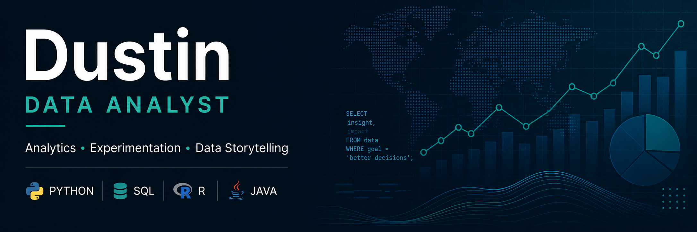

# Dustin — Data Analytics Portfolio

## Overview

Data analytics graduate focused on turning raw data into actionable insights through statistical analysis, visualization, and applied problem-solving.

---

## Statistical Analysis Projects

### [A/B Test Analysis](https://github.com/Somefatpickles/AB-Test-Analysis)

Statistical evaluation of product changes using hypothesis testing to determine meaningful differences in user behavior.

**Focus:** Experimentation · Statistics · Decision Analysis
**Tech:** Python, SciPy, Pandas

---

### [Physical Activity and Annual Income Analysis](https://github.com/Somefatpickles/Physical-Activity-and-Annual-Income-Analysis)

Examination of relationship between physical activity levels and annual income in the U.S. using Spearman's Rank Correlation.

**Focus:** Correlation Analysis · Statistics · Public Data
**Tech:** Python, Pandas, Matplotlib

---

## Exploratory Data Analysis Projects

### [Washington EV Infrastructure Analysis](https://github.com/Somefatpickles/WA-EV-Infrastructure-Analysis)

Exploratory analysis of EV adoption and charging infrastructure distribution across Washington State.

**Focus:** Geospatial Analytics · Public Data · Trend Analysis
**Tech:** Python, Pandas, Matplotlib

---

### [Medical No-Show Appointment Analysis](https://github.com/Somefatpickles/Medical-Appointment-Analysis)

Investigation of factors influencing patient attendance behavior in healthcare scheduling data.

**Focus:** Operational Analytics · Behavioral Patterns · Healthcare Data
**Tech:** Python, Seaborn, Pandas

---

### [Bikeshare Data Exploration with R](https://github.com/Somefatpickles/Bikeshare-Data-Exploration-with-R)

Explore bikeshare usage data to identify patterns in rider behavior across different user types and locations using R programming language.

**Focus:** Data Cleaning · EDA · Feature Engineering
**Tech:** R (programming language), dplyr, ggplot2

---

## Scripting and Programming Projects

### [Historical Weather Data Application](https://github.com/Somefatpickles/Historical-Weather-Data-Python-App)

Python-based weather application for retrieval and storage of historical weather data via REST API integration and local SQLAlchemy database functionality.

**Focus:** API Integration · SQLAlchemy · Dependencies
**Tech:** Python

---

### [Multi-Language Learning Tool](https://github.com/Somefatpickles/Multi-Language-Learning-Tool-with-Python)

A simple command-line language learning application developed in Python, designed to help users practice and reinforce vocabulary or phrase recognition.

**Focus:** Conditional Logic · Loops and control flow · User input handling
**Tech:** Python, CLI

---

### [Vending Machine Application with Java](https://github.com/Somefatpickles/Vending-Machine-Application-with-Java)

Console-based vending machine simulation developed in Java which allows users to interact with a virtual vending machine by selecting products, processing purchases, and managing user input through a command-line interface.

**Focus:** Conditional Logic · Purchase and transaction handling · User input handling
**Tech:** Java, OOP concepts, CLI

---

## Additional Projects

### [ETL Pipeline with Postgres](https://github.com/Somefatpickles/ETL-Pipeline-with-Postgres)

Postgres-based project designed to simulate functional ETL processes using Python scripts with JSON files.

**Focus:** Extract, Transform, Load (ETL) · Database basics · JSON Context Management
**Tech:** Python, Postgres

---

Additional projects and technical exercises available [on my GitHub repositories](https://github.com/Somefatpickles?tab=repositories).

---

## Skills

* Python (Pandas, NumPy, Matplotlib, Seaborn)
* Statistical Analysis & A/B Testing
* Data Cleaning & EDA
* Visualization & Storytelling
* Basic Java & Application Development

---

## Contact

Available for entry-level data analyst opportunities at **dustinjwhitehouse@gmail.com**.
